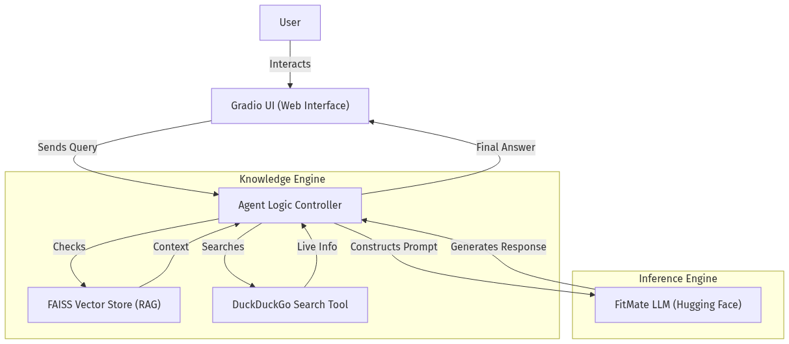
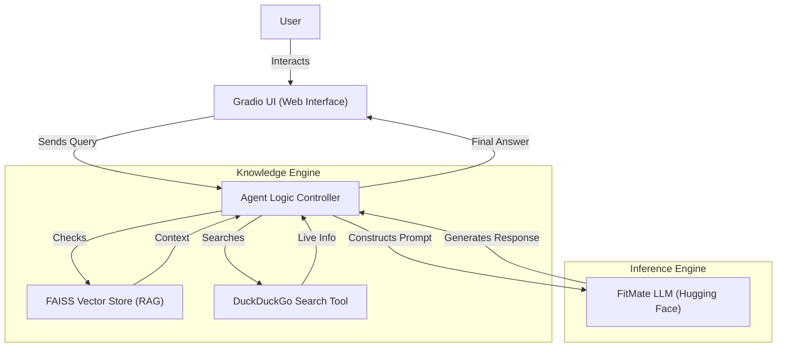

# 💪 FitMate - AI-Powered Fitness Coach

<div align="center">



**Your Personal AI Fitness Coach powered by Advanced Language Models**

[](https://www.python.org/downloads/)
[](https://gradio.app/)
[](LICENSE)

[Demo](#-demo) • [Features](#-features) • [Installation](#-installation) • [Usage](#-usage) • [Architecture](#-architecture) • [Documentation](#-documentation)

</div>

---

## 📋 Table of Contents

- [Overview](#-overview)
- [Features](#-features)
- [Demo](#-demo)
- [System Architecture](#-system-architecture)
- [Installation](#-installation)
- [Usage](#-usage)
- [Deployment](#-deployment)
- [Project Structure](#-project-structure)
- [Technologies Used](#-technologies-used)
- [Documentation](#-documentation)
- [Contributing](#-contributing)
- [License](#-license)
- [Authors](#-authors)

---

## 🎯 Overview

**FitMate** is an advanced AI-powered fitness coaching application that provides personalized workout plans, nutrition advice, and comprehensive health guidance. Built as a graduation project, FitMate leverages state-of-the-art Large Language Models (LLMs) and Retrieval-Augmented Generation (RAG) to deliver expert-level fitness coaching.

### Key Highlights

- 🤖 **AI-Powered Coaching**: Uses fine-tuned language models for personalized fitness advice
- 📚 **RAG Integration**: Upload your own PDFs (lab results, diet plans) for context-aware answers
- 🌐 **Web Search**: Fetches latest health research and fitness trends in real-time
- 🎨 **Premium UI**: Dark-themed, professional interface with glassmorphism design
- 🌍 **Multilingual**: Supports both English and Arabic (Egyptian dialect)

---

## ✨ Features

### 🏋️ Fitness Coaching
- **Personalized Workout Plans**: Custom routines based on your goals, equipment, and fitness level
- **Nutrition Planning**: Macro calculations, meal prep guides, and diet recommendations
- **Recovery Advice**: Sleep optimization, rest day planning, and injury prevention
- **Progress Tracking**: Goal setting and monitoring tools

### 🧠 AI Capabilities
- **Context-Aware Responses**: RAG system that uses your uploaded documents
- **Real-time Research**: Web search integration for latest fitness studies
- **Multi-turn Conversations**: Maintains chat history for coherent interactions
- **Specialized Modes**: Fat-loss, muscle-building, and rehab-focused coaching

### 💎 Premium Features
- **Multiple Chat Sessions**: Create and manage separate conversation threads
- **Document Upload**: Process fitness PDFs for personalized context
- **Turbo Mode**: Optimized inference for faster responses
- **Pro UI**: Modern, responsive interface with dark theme

---

## 🎬 Demo

### Interface Preview

The application features a professional, dark-themed interface with:
- **Home Tab**: Landing page with feature overview
- **Chat Tab**: Interactive AI coaching interface
- **Knowledge Base Tab**: Document upload and management
- **Settings Tab**: User preferences and model configuration

### Live Demo

🚀 **[Try FitMate Live](https://huggingface.co/spaces/YOUR_USERNAME/fitmate)** *(Replace with your actual Space URL)*

Working on it right now ...
---

## 🏗️ System Architecture



### Components

- **Frontend**: Gradio-based web interface with custom CSS styling
- **Backend**: Python-based agent orchestrating LLM, RAG, and search
- **Model**: Fine-tuned Llama-based model (moamenshamed/fitmate)
- **Vector Store**: FAISS for efficient document retrieval
- **Search**: DuckDuckGo integration for real-time information

---

## 🚀 Installation

### Prerequisites

- Python 3.10 or higher
- CUDA-capable GPU (recommended, 16GB+ VRAM)
- 20GB free disk space
- Hugging Face account and token

### Step 1: Clone Repository

```bash
git clone https://github.com/YOUR_USERNAME/fitmate.git
cd fitmate
```

### Step 2: Install Dependencies

```bash
pip install -r requirements.txt
```

### Step 3: Set Environment Variables

**Windows (PowerShell):**
```powershell
$env:HF_TOKEN="your_huggingface_token_here"
```

**Linux/Mac:**
```bash
export HF_TOKEN="your_huggingface_token_here"
```

> 💡 Get your token from [Hugging Face Settings](https://huggingface.co/settings/tokens)

---

## 💻 Usage

### Running Locally

1. **Start the Application:**
   ```bash
   python app.py
   ```

2. **Access the Interface:**
   - Open your browser to `http://localhost:7860`
   - The app will also provide a public shareable link (valid for 72 hours)

3. **Using FitMate:**
   - Navigate to the **Chat** tab
   - Type your fitness questions
   - Upload PDFs in the **Knowledge Base** tab for personalized advice
   - Customize settings in the **Settings** tab

### Example Queries

```
"Create a 4-week muscle building program for a beginner"
"What should I eat to lose 10kg in 3 months?"
"How do I recover from a shoulder injury?"
"أعطيني برنامج تمرين لمدة شهر" (Arabic)
```

---

## 🌐 Deployment

### Option 1: Hugging Face Spaces (Recommended)

1. Create a new Space on [Hugging Face](https://huggingface.co/spaces)
2. Select **Gradio** SDK
3. Choose **GPU** hardware (Nvidia T4 or A10G)
4. Upload `app.py` and `requirements.txt`
5. Add `HF_TOKEN` as a secret in Space settings
6. Deploy!

**Cost**: Free tier available, ~$0.60/hour for persistent GPU

### Option 2: Modal

See the deployment guide in `modal_deploy.py` for instructions.

### Option 3: Local + Ngrok

For temporary public access:
```bash
pip install pyngrok
ngrok http 7860
```

---

## 📁 Project Structure

```
fitmate/
├── app.py                              # Main application file
├── requirements.txt                    # Python dependencies
├── README.md                           # This file
├── FitMate_Architecture.png            # Architecture diagram
├── FitMate_Project_Documentation.pdf   # Full project documentation
├── fitmate.ipynb                       # Development notebook (Modal)
└── .gitignore                          # Git ignore file
```

---

## 🛠️ Technologies Used

### Core Framework
- **[Gradio](https://gradio.app/)** - Web interface framework
- **[Python 3.10+](https://python.org)** - Programming language

### AI/ML Stack
- **[Transformers](https://huggingface.co/transformers/)** - LLM inference
- **[PyTorch](https://pytorch.org/)** - Deep learning framework
- **[Sentence Transformers](https://www.sbert.net/)** - Embedding models
- **[BitsAndBytes](https://github.com/TimDettmers/bitsandbytes)** - 4-bit quantization

### Data & Search
- **[FAISS](https://github.com/facebookresearch/faiss)** - Vector similarity search
- **[DuckDuckGo Search](https://github.com/deedy5/duckduckgo_search)** - Web search API
- **[PyPDF2](https://pypdf2.readthedocs.io/)** - PDF processing

### Deployment
- **[Hugging Face Hub](https://huggingface.co/)** - Model hosting
- **[Hugging Face Spaces](https://huggingface.co/spaces)** - App deployment

---

## 📖 Documentation

Full project documentation is available in **[FitMate_Project_Documentation.pdf](FitMate_Project_Documentation.pdf)**, which includes:

- Project planning and stakeholder analysis
- System architecture and database design
- UI/UX design decisions
- Implementation details
- Future improvements

---

## 🤝 Contributing

As this is a graduation project, contributions are currently not being accepted. However, feel free to:

- ⭐ Star the repository
- 🐛 Report bugs via Issues
- 💡 Suggest features via Issues
- 🔀 Fork the project for your own use

---

## 📄 License

This project is licensed under the MIT License - see the [LICENSE](LICENSE) file for details.

---

## 👥 Authors

**Moamen Sadd** , **Ahmed Samir** , **Mariam Ali** , **Salma Mohamed**
- GitHub: [@moamenshamed](https://github.com/moamenshamed)
- Hugging Face: [@moamenshamed](https://huggingface.co/moamenshamed)

**Project Supervisor**: [Eng: Mohamed ElMesawy]  
**Institution**: [Digital Egypt Pioneers Initiative (DEPI)]  
**Year**: 2025

---

## 🙏 Acknowledgments

- Thanks to the Hugging Face team for their incredible tools and infrastructure
- The open-source community for the libraries that made this possible
- All the fitness experts whose knowledge inspired this project

---

<div align="center">

**⭐ If you find this project useful, please consider giving it a star! ⭐**

Made with ❤️ and 💪 by Moamen Saad

</div>
